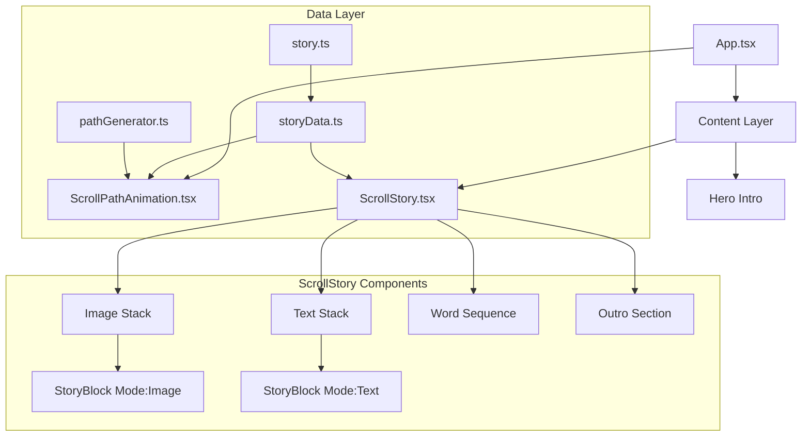

# Architecture & Visual Baseline

> **Status:** Stable / Extensible (v2.3.0 - Visual Enhancements)
> **Last Visual Verification:** Feb 2026

## 1. High-Level Overview
The application is a **high-fidelity "Scrollytelling" experience** where a continuous SVG path draws itself in sync with the user's scroll, revealing narrative elements (images, text) at precise intervals. 

**Core Stack:** React, TypeScript, Tailwind CSS, Framer Motion.

**Key Features:**
- Data-driven content generation from `storyData.ts`
- Radial gradient background for subtle depth
- Glowing SVG path with dual-layer drop-shadow
- Mix-blend-difference text inversion
- Word sequence with typewriter animation
- Outro section with fading text

## 2. Visual Baseline (Stable State)
This section captures the expected visual state. Use this to verify regressions.

### Key Milestones
| Milestone | Description |
|---|---|
| **01 Intro** | "SCROLL" hero text. Glowing path visible at top. Radial gradient background. |
| **02 Slide 1** | Image-left layout. Text inverts against image. Path curves around content. |
| **03 Slide 2** | Image-right layout. Split-layer effect active. |
| **04 Word Sequence** | "Continuity" → "Consistency" → "Connection" typewriter effect. |
| **05 Outro** | "The path is not linear." and "It extends beyond the frame." fade in/out. |

---

## 3. Architecture & Key Strategies

### The "Block-Based" Data Architecture
Content is defined in `src/config/storyData.ts`.
- **`STORY_DATA`**: Array of `StoryBlock` objects.
- **Block Types:** `hero`, `duo`, `sequence`, `outro`
- **Polymorphism**: Switch renderers based on `type` field.

### The "Split-Stack" Strategy (Text Inversion)
**Stack 1 (Bottom): Images** - No blend mode.
**Stack 2 (Top): Text** - `mix-blend-difference` applied.

> **CRITICAL:** Both stacks use identical `StoryBlock` logic with different `mode` prop.

### Component Map


---

## 4. Visual Enhancements (v2.3.0)

### Radial Gradient Background
**File:** `App.tsx`
```css
background: radial-gradient(circle at 50% 40%, #0a0a0a 0%, #000000 60%);
```
- Adds subtle depth without breaking `mix-blend-difference`
- Centered slightly above middle (40%) to draw eye to hero text

### Glowing SVG Path
**File:** `ScrollPathAnimation.tsx`
```css
filter: drop-shadow(0 0 8px rgba(255, 255, 255, 0.6)) 
        drop-shadow(0 0 16px rgba(255, 255, 255, 0.3));
```
- Dual-layer glow (8px inner + 16px outer)
- Premium, modern aesthetic

---

## 5. Configuration Points

| Location | Config | Purpose |
|---|---|---|
| `src/config/storyData.ts` | `STORY_DATA` | Content (Text, Images, Layout) |
| `src/utils/pathGenerator.ts` | `generatePathData` | SVG path math |
| `src/components/StoryBlock.tsx` | `GLOBAL_CONF` | Animation tuning |
| `src/components/ScrollPathAnimation.tsx` | `PATH_CONFIG` | Path stroke & physics |

## 6. Directory Structure
```text
src/
├── components/
│   ├── ScrollPathAnimation.tsx # SVG path with glow
│   ├── ScrollStory.tsx         # Split-stack orchestrator
│   └── StoryBlock.tsx          # Generic render unit
├── config/
│   └── storyData.ts            # Content definition
├── utils/
│   └── pathGenerator.ts        # SVG math
├── types/
│   └── story.ts                # TypeScript interfaces
├── assets/                     # Images
├── App.tsx                     # Root (gradient background here)
├── main.tsx
└── index.css                   
```

## 7. Development Guidelines
- **Strict Mode:** Enabled.
- **Extensibility:** Add slides via `storyData.ts` only.
- **Respect Existing Art:** `pathGenerator` has hardcoded overrides for blocks 0 and 1.
- **No Visual Regressions:** Test all changes against baseline milestones.
